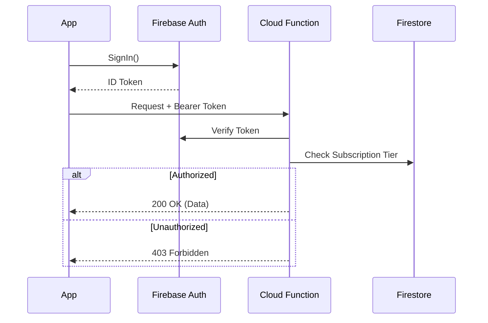

# DermalVision Cloud API Documentation

## Overview
DermalVision utilizes Firebase Cloud Functions (v2) for backend logic, AI orchestration, and third-party integrations. All functions are deployed to the `us-central1` region.

## Authentication & Authorization

All API interactions require a valid **Firebase Auth ID Token**.

### Obtaining a Token
1.  **Client (Flutter):** User signs in via Email/Google/Apple.
2.  **SDK:** `FirebaseAuth.instance.currentUser?.getIdToken()`
3.  **Header:** Attach to requests as `Authorization: Bearer <TOKEN>`.

### Authorization Flow


## Rate Limits & Quotas

To ensure stability and prevent abuse, the following limits apply:

| Resource | Limit | Period | Response |
| :--- | :--- | :--- | :--- |
| **Analysis Requests** | 10 | Per Hour / User | `429 Too Many Requests` |
| **SkinShurpa Chat** | 50 | Per Day / User | `429 Too Many Requests` |
| **Image Uploads** | 100 MB | Per Day / User | `413 Payload Too Large` |
| **Concurrent Sessions**| 1 | Per User | `409 Conflict` |

## Error Handling

Standardized JSON Error Response:
```json
{
  "error": {
    "code": 400,
    "status": "INVALID_ARGUMENT",
    "message": "Image resolution too low (min 1024x1024).",
    "details": [
      {
        "field": "image",
        "issue": "resolution_check_failed"
      }
    ]
  }
}
```

## Cloud Functions Reference

### 1. Analysis Orchestrator
**Trigger:** Firestore `onCreate` (document: `analysis_requests/{requestId}`) or Storage `onFinalize` (bucket path: `uploads/{uid}/{sessionId}/raw.jpg`)
**Description:** Orchestrates the multi-model analysis pipeline.
- **Inputs:** `sessionId`, `imageUrl`, `zoneId`
- **Process:**
  1.  Validates request and user subscription tier.
  2.  Dispatches parallel calls to Vertex AI (MedGemma, Acne Model, Wrinkle Model).
  3.  Aggregates results into a unified `AnalysisResult` object.
  4.  Updates Firestore document `sessions/{sessionId}` with results.
  5.  Triggers push notification via FCM.

### 2. SkinShurpa AI Assistant
**Trigger:** HTTPS Callable `chatWithSkinShurpa`
**Description:** Handles conversational AI interactions with context awareness.
- **Request Body:**
  ```json
  {
    "message": "Is this spot normal?",
    "context": {
      "sessionId": "session_123",
      "zoneId": "face_left_cheek"
    }
  }
  ```
- **Response:** Streaming `text/event-stream` or JSON with Markdown-formatted response.

### 3. Subscription Management
**Trigger:** HTTPS Callable `handleRevenueCatWebhook`
**Description:** Processes subscription status updates from RevenueCat.
- **Events:** `INITIAL_PURCHASE`, `RENEWAL`, `CANCELLATION`, `EXPIRATION`.
- **Action:** Updates `users/{uid}` with `subscriptionStatus` and `tier`.

### 4. Notification Scheduler
**Trigger:** Pub/Sub Schedule (Daily/Weekly)
**Description:** Checks user preferences and scheduling rules to send reminder notifications.
- **Logic:**
  - Queries active schedules in `schedules/{scheduleId}`.
  - Checks if a scan was already performed today.
  - Sends FCM message if reminder is due.

## Vertex AI Endpoints

### MedGemma 1.5 (Skin Condition Classifier)
- **Endpoint ID:** `projects/dermalvision-prod/locations/us-central1/endpoints/MEDGEMMA_ID`
- **Input:** Base64 encoded image or GCS URI.
- **Output:** Probability distribution over 40+ dermatological conditions.

### Custom Acne Severity Model
- **Endpoint ID:** `projects/dermalvision-prod/locations/us-central1/endpoints/ACNE_ID`
- **Input:** Cropped face regions (forehead, cheeks, chin).
- **Output:** Severity Grade (0-4) and lesion count.

## Versioning
- **Current Version:** v1
- **Deprecation Policy:** Breaking changes will be introduced in v2 with a 6-month support window for v1.
